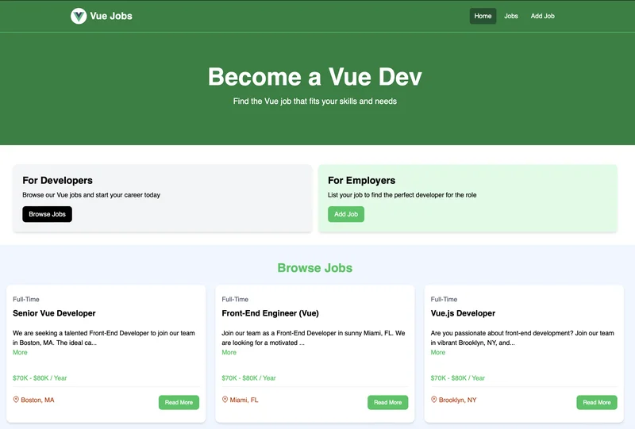
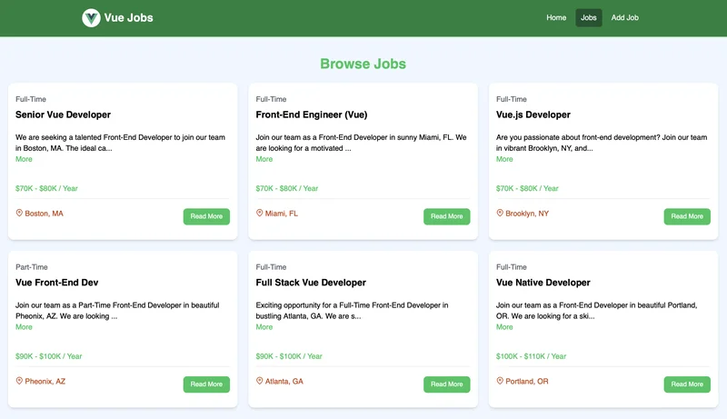
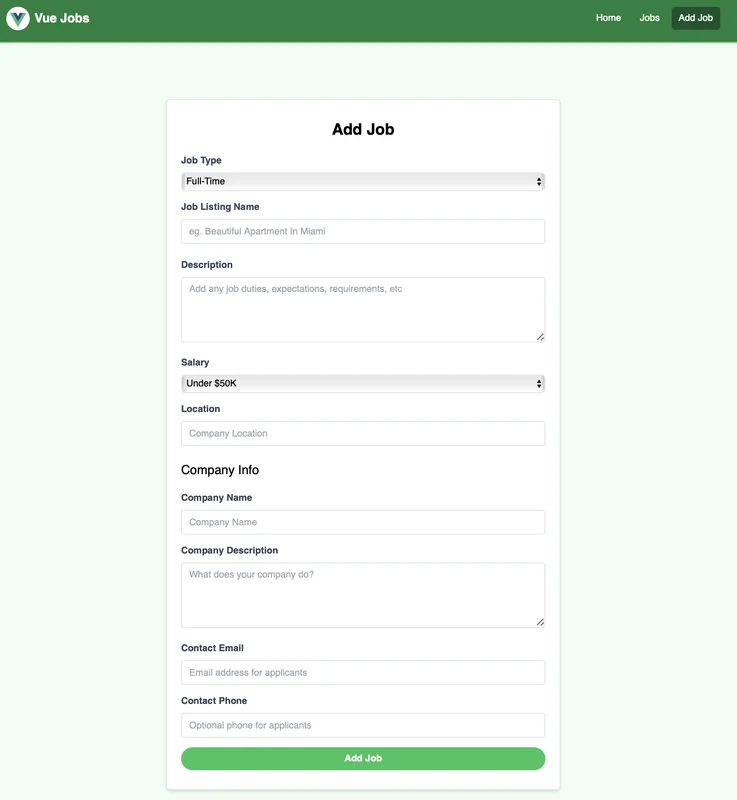
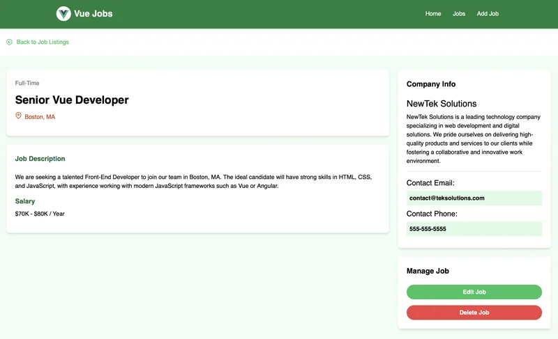

# React Jobs

React Jobs is a web application designed to connect React developers with potential employers. It features a clean and modern interface, making it easy for both job seekers and employers to navigate and use.

## Screenshots

### Homepage



- Displays a call to action for developers and employers.
- Features recent job listings with details such as job title, location, and salary range.

### Browse Jobs



- Displays all job listings available for browsing.
- Each listing shows the job title, location, and salary range.

### Add Job Page



- A form for employers to add new job listings.
- Includes fields for job type, job listing name, description, salary, location, company info, and contact details.

### Update Job Page


- A form similar to the Add Job page, allowing employers to update existing job listings.
- Pre-filled with the current job details for easy editing.

### Job Details Page



- Provides detailed information about a specific job listing.
- Includes the job description, salary, company info, and contact details.
- Options to edit or delete the job listing.

## Usage

This project uses JSON-Server for a mock backend, making it easy to test and develop without setting up a full backend environment.

### Install Dependencies

Run the following command to install the necessary dependencies:

```bash
npm install
```

### Run JSON Server

Start the JSON server to simulate the backend:

```bash
npm run server
```

The server will run on [http://localhost:8000](http://localhost:8000).

### Run Vite Frontend

Start the React frontend using Vite:

```bash
npm run dev
```

The frontend will run on [http://localhost:3000](http://localhost:3000).

### Build for Production

Create a production build of the application:

```bash
npm run build
```

### Preview Production Build

Preview the production build locally:

```bash
npm run preview
```

## Web Development Services

This project is part of the web development services provided by [PVSensors.com](https://pvsensors.com/). We specialize in creating custom web applications, including job boards, e-commerce platforms, and business websites. Visit our website to learn more about our services and how we can help bring your project to life.
